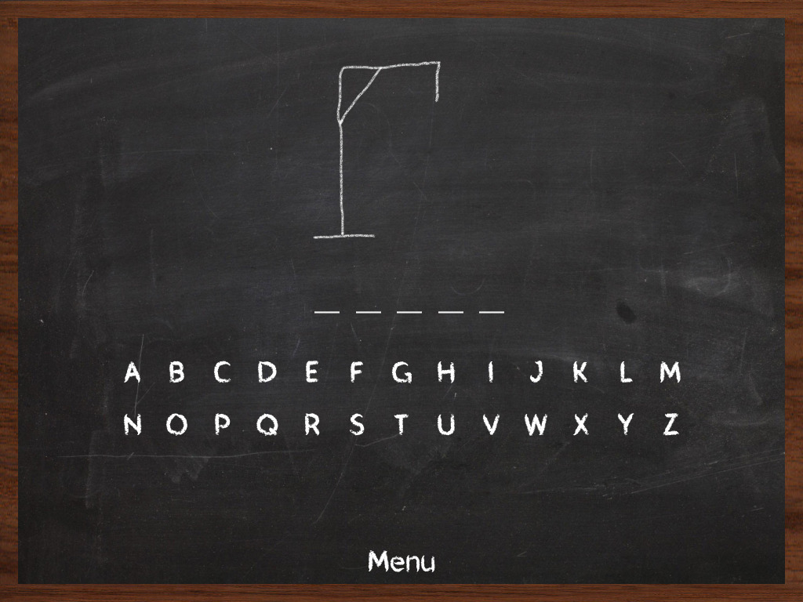

# :video_game: Jogo da Forca


## :dart: Projeto da cadeira de Linguagem de Programação Funcional 2020.2

O jogo da forca é um jogo em que o jogador tem que acertar qual é a palavra proposta, tendo como dica o número de letras. A cada letra errada, é desenhado uma parte do corpo do enforcado.
Perde-se caso a imagem do enforcado fique completa e ganha-se caso a palavra seja adivinhada.



> Um jogo de Browser com a temática de jogo da forca. Trabalho predominantemente funcional feito em Kotlin, juntamente com um tradutor para Java Script.

## 🚀 Instalando O Jogo da Forca

Para instalar o Jogo da Forca é somente necessáio clona-lo:

* Basta digitar ` git clone https://github.com/gabrielmpinha/projeto-lpf.git` no terminal.

## ☕ Usando O Jogo da Forca

Para usar Jogo da Forca, siga estas etapas:

1. Usando por meio do projeto clonado:
    * Acesse o arquivo `index.html` do projeto, abra-o com a opção no navegador.
1. Usando por meio do link do site:
    * Acesse o jogo por meio desse link: [Jogo da Forca](https://gabrielmpinha.github.io/projeto-lpf/)
1. Usando por meio de máquina virtual (gitpod):
   * Use o seguinte link para acessar o projeto no ambiante do Gitpod:

      ```html
      gitpod.io/github.com/gabrielmpinha/projeto-lpf
      ```
   
   * Próximo passo é abrir uma porta, local onde a aplicação será hospedada, e torna-la publica:
      > Digite o seguinte comando no terminal:
   
      ```terminal
      php -S 0.0.0.0:8888
      ```
      
   * Feito isso, acesse a seção de "Remote explorer", como mostra na imagem a seguir:
   
      

   * Por fim, escolha a opção "open browser", na porta 8888, e a aplicação estará disponível para ser usada (com o link podendo ser compartilhado):
   
      

## :computer: Logica e estrutura do código :

Foi criada uma lista com as palavras a partir de um arquivo .txt, utilizamos subrotina para pegrar as palavras e selecionar uma aleatória após todas serem inseridas numa lista. 
As letras do teclado possuem evento de escuta associado a ação de clique a qual permite, quando o jogador clica, alterar os espaços para letras(acerto) ou fazer o jogador perder um ponto(erro). A cada jogada feita, é feita a checagem da imagem atual da forca, o jogo acaba quando a imagem atual é a de vitória ou derrota.

## :man_technologist: Contribuidores

Trabalho realizado por:

<table>
  <tr>
    <td align="center">
      <a href="https://github.com/gabrielmpinha">
        <br>
        <sub>
          <b>Gabriel Pinheiro</b>
        </sub>
      </a>
    </td>
    <td align="center">
      <a href="https://github.com/LucasHenrique-dev">
        <br>
        <sub>
          <b>Lucas Henrique</b>
        </sub>
      </a>
    </td>
  </tr>
</table>

## 📝 Licença

Esse projeto está sob licença. Veja o arquivo [LICENÇA](LICENSE) para mais detalhes.

[⬆ Voltar ao topo](#video_game-jogo-da-forca)<br>

## ℹ️ Informações do projeto

[](https://github.com/gabrielmpinha/projeto-lpf/issues)
[](https://github.com/gabrielmpinha/projeto-lpf/network)
[](https://github.com/gabrielmpinha/projeto-lpf/stargazers)
